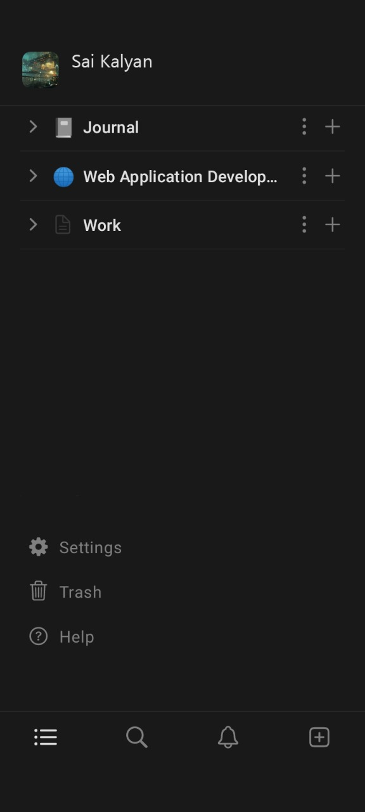
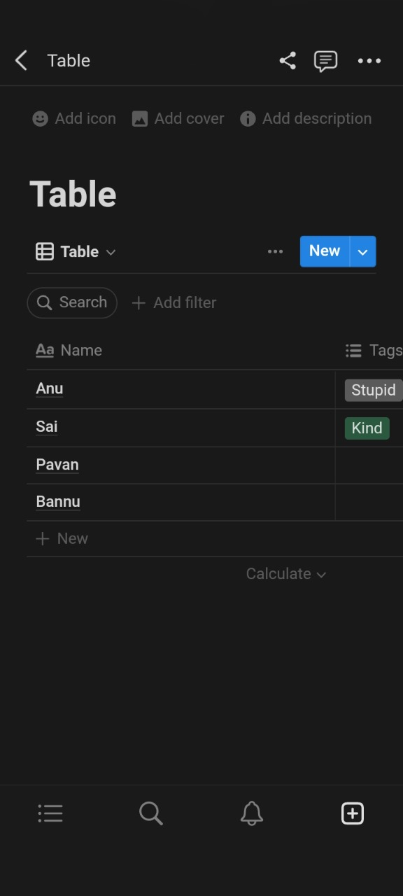
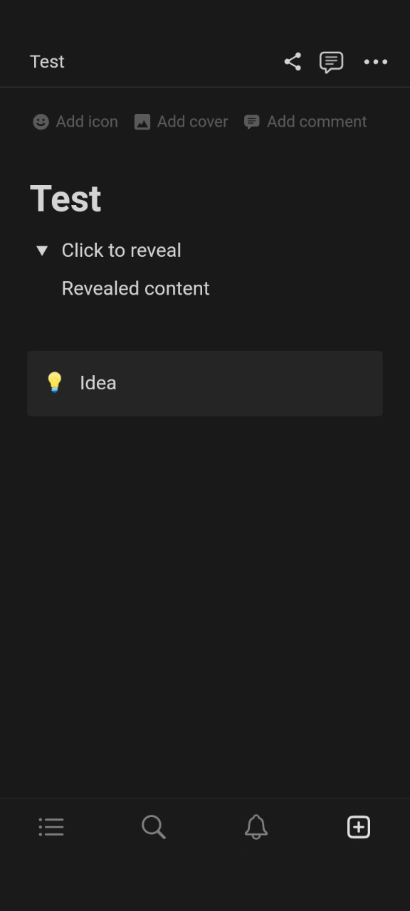
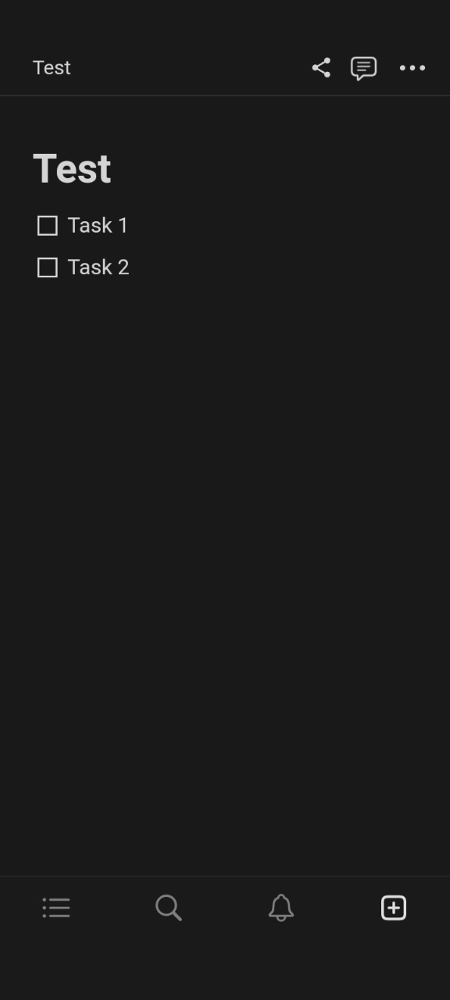
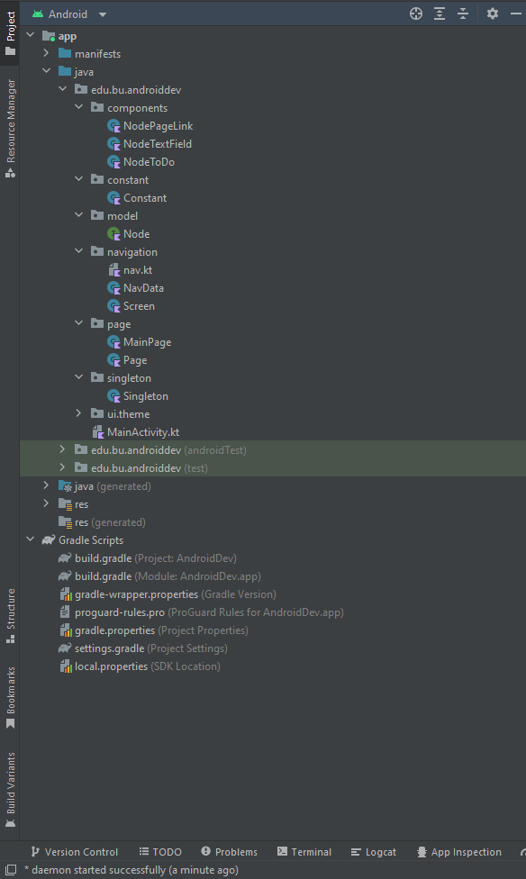
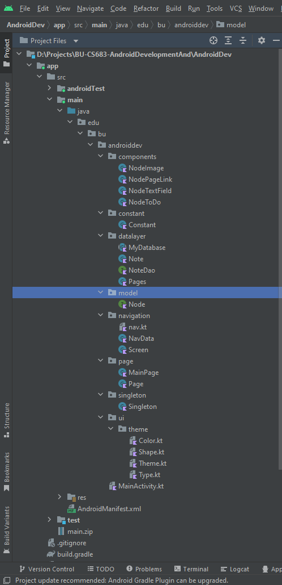

# Android Dev
Sai Kalyana Raman(U24553100)\
Shatrugna Rao Korukanti(U43517028)

---

## Overview

Our project is to build an utility android app. It is similar to the present day [Notion app](https://play.google.com/store/apps/details?id=notion.id). We aim to provide tools in assisting document generation and also integrate with google drive storage medium. We also plan to integrate live collaboration, p2p video and voice chat and workspace sharing. The app will be using markdown markup language to dynamically generate ui elements and for easy storage of the user document.

---

## Related Work

It is simlar to Notion app, and has few unique features. One which is integrating with Gdrive, and p2p video and voice chat. There could be a downgrade in the visual elements due to material design constraint in android.

---

## Requirement Analysis and Testing
 
| Title         | View project details (Essential)                                                                                                                                                                                                                                                                   | View project details (Desirable)                                                                                            | View project details (Optional)                                                                                                    |
|------------------|----------------------------------------------------------------------------------------------------------------------------------------------------------------------------------------------------------------------------------------------------------------------------------------------------|-----------------------------------------------------------------------------------------------------------------------------|------------------------------------------------------------------------------------------------------------------------------------|
| Description      | Our project is to build an utility android app similar to [Notion app](https://play.google.com/store/apps/details?id=notion.id). We aim to provide tools in assisting document generation and also integrate with google drive storage medium.                                                     | Additionally, We plan to integrate live collaboration, p2p video and voice chat and workspace sharing as desirable options. | The app can also have markdown markup language to dynamically generate ui elements and also for easy storage of the user document. |
| Mockups          | <table><thead><tr><th>sample_main</th><th>sample_page1</th></tr></thead><tbody><tr><td></td><td></td></tr><tr><td></td><td></td></tr></tbody></table> |                                                                                                                             |                                                                                                                                    |
| Acceptance Tests | UI components dynamic creation and data Retention of notion app in GDrive.                                                                                                                                                                                                                         | Testing of p2p networking, voice chat and live collaboration                                                                | markdown parser development                                                                                                        |
| Test Results     |                                                                                                                                                                                                                                                                                                    |                                                                                                                             |                                                                                                                                    |
| Status           |                                                                                                                                                                                                                                                                                                    |                                                                                                                             |                                                                                                                                    |

    
---

## Design and Implementation

- UI design and implementation
  - Jetpack Compose UI elements.
  - Composable functions can have Simple UI code like Row{Text(modifier = Modifier.padding(3.dp)){"Click"}} which replaces predefined static xml design.
  - The navigation component is handled using NavHost element in which you can declare path and call @composable function you want to display over the screen.
  - 
- Code Structure
  - There is a node interface that is implemented to all the components classes that are created.
  - The node interface list is created to put all the components in a single list for easy accessibility.
  - The code has multiple packages with proper name to define the purpose of it in the project.
  - The components are broken down into simple text data for it to be stored in db and can also be easily interpreted while dynamically generating the components UI.
- Activities
  - There are 2 main jetpack UI pages MainPage, Page.
  - MainPage contains link to navigate to other pages.
  - 
  - The Page can contain multiple components like textField, toDo checkbox, image component, and link to navigate other pages.
  - 
- Third party APIs
  - usage of Jackson Core for json serialization and deserialization.
- Database schema, data storage
  - The data of the pages and info were initially stored in the data store shared preferences.
  - The data storage have been moved to room.
    - There are 2 tables, one which contains the pages and the other table contains all the components that have been created in all the pages.
    - The data of components for a page is retrieved using a query to get the components that match to the selected page id.

---

## Project Structure
| Iteration 1              | Iteration 2                        |
|--------------------------|------------------------------------|
|  |  |

---

## Timeline

| Iteration | Application Requirements                                                                                                                                                                                                                                                                                               | Android Components and Features         | member 1 contribution/tasks                                                                                    | member 2 contribution/tasks                                                                                  |
|-----------|------------------------------------------------------------------------------------------------------------------------------------------------------------------------------------------------------------------------------------------------------------------------------------------------------------------------|-----------------------------------------|----------------------------------------------------------------------------------------------------------------|--------------------------------------------------------------------------------------------------------------|
| 1         | <table><thead><tr><th>Essential</th><th>Desirable</th><th>Optional</th></tr></thead><tbody><tr><td>App Layout UI tools development</td><td>Complex UI development  such as table and kanban board</td><td>Hyperlinks and image ui integration.</td></tbody></table>                                              | Jetpack Compose                         | Design and implement app layout, Functional Implementation of components                                       | Navigation implementation, data storage of the UI components. Testing of the app and performing minor fixes. |
| 2         | <table><thead><tr><th>Essential</th><th>Desirable</th><th>Optional</th></tr></thead><tbody><tr><td>Serialization of UI data and integrating gdrive api.</td><td>Integrating voice and video chat using webrtc protocol.</td><td>serialization of data in the form of markdown markup language.</td></tbody></table> | Google Drive Kotlin APIs'               | Room database api implementation, moving from shared preferences data store to room. Google mail OAuth system. | Image component and integration of room api with current design of the application.                          |
| 3         | <table><thead><tr><th>Essential</th><th>Desirable</th><th>Optional</th></tr></thead><tbody><tr><td>Unit testing of functional components and gdrive api.</td><td>Live collaboration of the document with invited friends.</td><td>None</td></tbody></table>                                                            | Fixing issues and improving performance | JUNIT test cases and live Testing of the app                                                                   | Live Collaboration feature implementation                                                                    |

---

## Future Work (Optional)
| Iteration | Missed Implementation                                                                                                                                                |
|-----------|----------------------------------------------------------------------------------------------------------------------------------------------------------------------|
| 1         | Image component implementation missed due to time constraint.                                                                                                        |
|           | Table component implementation missed due to not being able to figure out the implementation in jetpack compose.                                                     |
| 2         | Gdrive sqlite db file upload is not implemented due to time constraint.                                                                                              |
|           | Missing few components like table, kanban boards due to complexity of their implementation.                                                                          |
|           | The room data is stored and queried to a string which hampers performance, needs to be queried to pk for performance and allowing duplicate names of data components |
|           | Delete functionality not yet implemented.                                                                                                                            |
|           | There are few errors with the storage of the data.                                                                                                                   |

---

## References

[Notion app](https://play.google.com/store/apps/details?id=notion.id)
