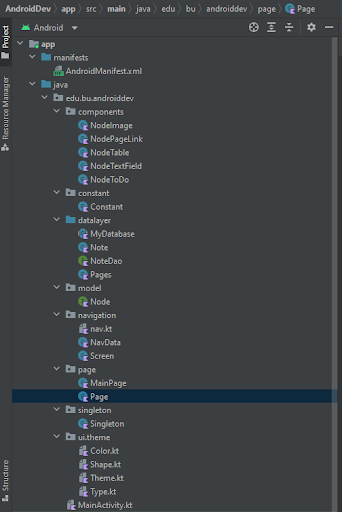

# Android Clone
Sai Kalyana Raman(U24553100)\
Shatrugna Rao Korukanti(U43517028)

---

## Overview

Our project is to build an utility android app. It is similar to the present day [Notion app](https://play.google.com/store/apps/details?id=notion.id). We aim to provide tools in assisting document generation and also integrate with google drive storage medium.

---

## Related Work

It is simlar to Notion app, with dynamic creation of components over an infinite long screen. It mimics the operation of writing a diary and storing notes of a user. There could be a downgrade in the visual elements due to material design constraint in android jetpack compose.

---

## Design and Implementation

- UI design and implementation
  - Jetpack Compose UI elements.
    - Jetpack Compose is a modern UI toolkit recently launched by Google which is used for building native Android UI.
    - Declarative: It is fully declarative so that you can describe your UI components by calling some predefined functions.
    - All the UI and states are declared inside composable functions.
    - The most basic UI elements are the Row, Column which are used for layout, since everything in the jetpack compose can be visually viewed as grid.
    - The UI and logic are entirely written in kotlin which allows the user to not create unnecessary XML UI files.
    - Drawbacks include inflexible ui styling, and in this project the ui cannot be viewed until the code is compiled and run on an emulator or device.
  - Composable functions can have Simple UI code like Row{Text(modifier = Modifier.padding(3.dp)){"Click"}} which replaces predefined static xml design.
  - The navigation component is handled using NavHost element in which you can declare path and call @composable function you want to display over the screen.
  - 
- Code Structure
  - There is a node interface that is implemented to all the components classes that are created.
  - The node interface list is created to put all the components in a single list for easy accessibility.
  - The code has multiple packages with proper name to define the purpose of it in the project.
  - The components are broken down into simple text data for it to be stored in db and can also be easily interpreted while dynamically generating the components UI.
- Activities
  - There are 2 main jetpack UI pages MainPage, Page.
  - MainPage contains link to navigate to other pages.
  - 
  - The Page can contain multiple components like textField, toDo checkbox, image component, table and link to navigate other pages.
  -  
- Third party APIs
  - usage of Jackson Core for json serialization and deserialization.
- Database schema, data storage
  - The data of the pages and info were initially stored in the data store shared preferences.
  - The data storage have been moved to room.
    - There are 2 tables, one which contains the pages and the other table contains all the components that have been created in all the pages.
    - The data of components for a page is retrieved using a query to get the components that match to the selected page id.

---

## Project Structure
 

| Packages   | Description                                                                                                                                                         | Files                                                                                                                                                                                                                                   |
|------------|---------------------------------------------------------------------------------------------------------------------------------------------------------------------|-----------------------------------------------------------------------------------------------------------------------------------------------------------------------------------------------------------------------------------------|
| Components | contains kotlin classes with composable render function and state variables. They implement Node interface. It handles deserialization and serialization of room DB | - NodeImage - responsible for adding image - NodePageLink - responsible for redirectingNodeTable - responsible for table  - NodeTextField - responsible for basictextfield  - NodeToDo - responsible for checkbox textfield    |
| Constant   | contain constants variables                                                                                                                                         | - constant - final static variables                                                                                                                                                                                                     |
| Datalayer  | contains code for instantiation of Room DB and related classes                                                                                                      | - MyDatabase - initiates room db object  - Note - Data model class to store pages  - Pages - Data model class to store components data  - NoteDao - A Dao layer which contains operations for both Note and Pages data models. |
| Model      | contain model classes or interfaces                                                                                                                                 | - Node - Interface for the components. Contains functions for serialization and deserialization.                                                                                                                                        |
| Navigation | contains navigation codes                                                                                                                                           | - Nav - initialises navcontroller  - navData - stores info of the url path                                                                                                                                                           |
| Page       | contains ui which spans across the screen and are mapped to the navigation                                                                                          |  - MainPage - First viewable screen to contain only redirect component  - Page - composable function which can hold all the components.                                                                                           |
