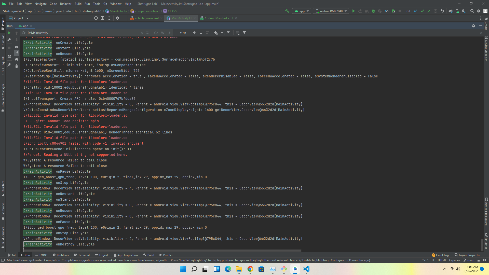

# Lab1

[GithubRepo](https://github.com/CS683/lab1-Shatrugna-Strife)

Experience with android studio - felt comfortable after following the lab1 instruction pdf.

|Action| call backs in order|
|-|-|
|open the app| onCreate -> onStart -> onResume |
|close the app| onPause -> onStop -> onDestroy |
|press the home button| onPause -> onStop |
|reOpen the open| onRestart -> onStart -> onResume |

Shatrugna Rao Korukanti\
U43517028