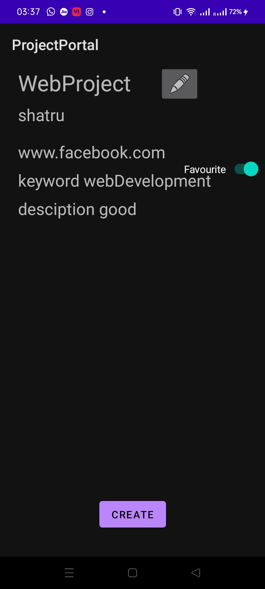
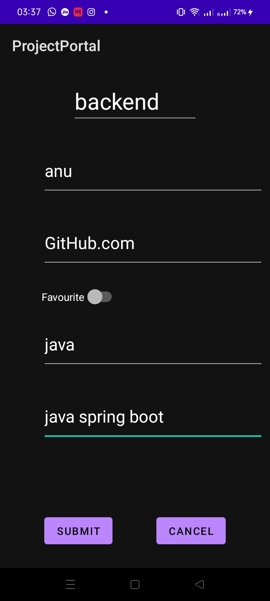
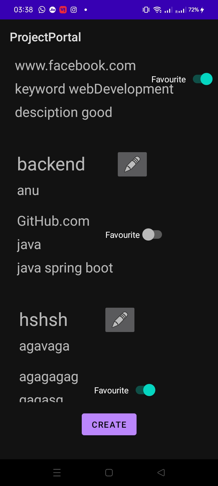

# Lab2

[GithubRepo](https://github.com/CS683/projectportallabs-Shatrugna-Strife)

- The lab is entirely done using fragments.
- I took the existing app, and created a new fragment layout called fragment-detail-component.\

- Changed the detail fragment to contain a scroll view and create button.
- Created a create fragment which takes details from the user and puts in a static array.\

- The edit fragment contains textfield with the user values that can be edited and updated.
- The detail fragment displays the data by adding fragment-detail-component at the runtime.
- the detail fragment has scrollable component to fit large number of fragments\

Shatrugna Rao Korukanti\
U43517028