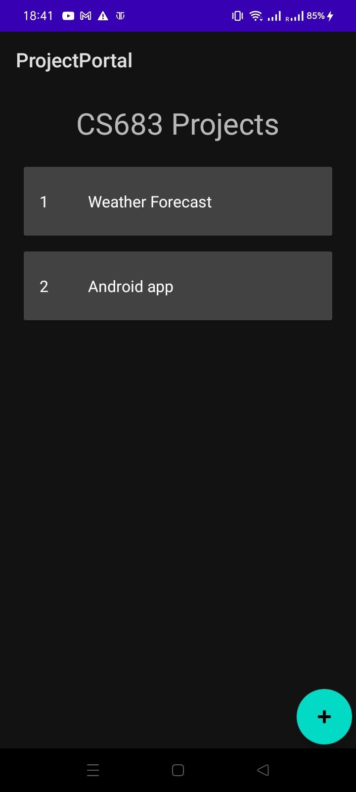
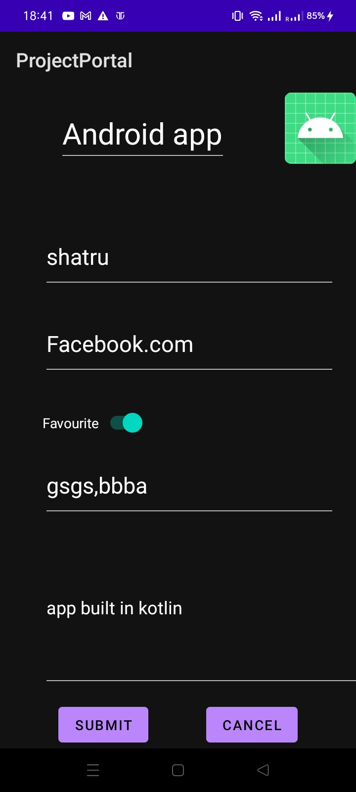
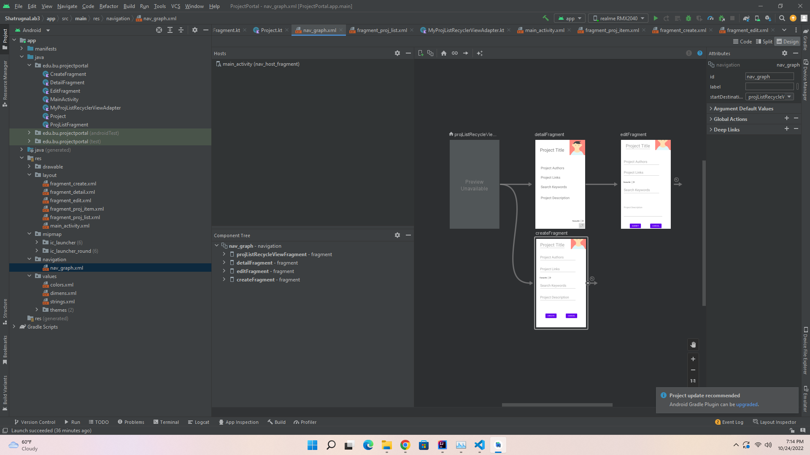

# Lab3

[GithubRepo](https://github.com/CS683/projectportallabs-Shatrugna-Strife) The repo contains the lab3 code and doc too.

- The lab is entirely done using fragments.
- I took the lab2 app, and added the detail fragment from the example code, its uses RecycleView and cardview.\

- Implemented the add button which redirects to create fragment.\

- I used the navigation graph for the redirecting.\

- Rest are pretty much similar to lab2.

Shatrugna Rao Korukanti\
U43517028