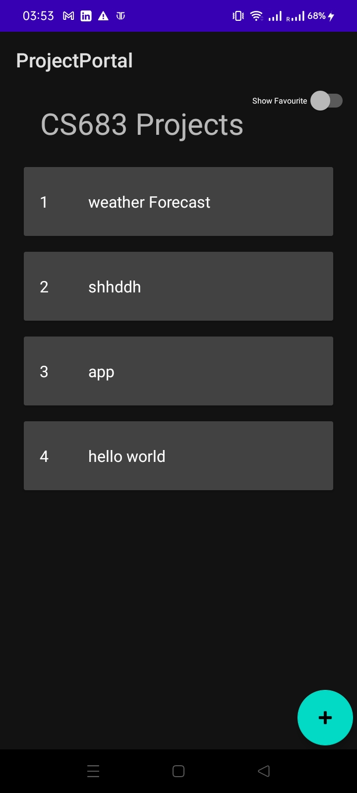
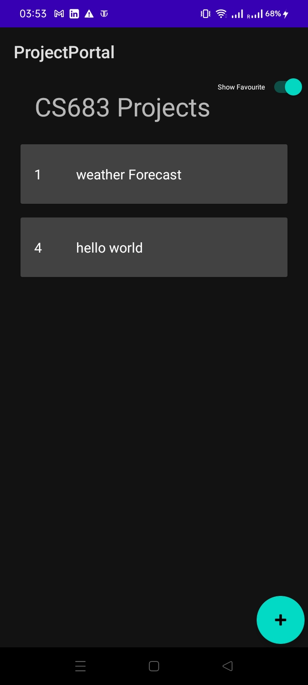

# Lab4

[GithubRepo](https://github.com/CS683/projectportallabs-Shatrugna-Strife) The repo contains the lab4 code and doc too.

- Implemented Room Dao and shared prefences.
- The projects are added to the room DB.\

- The favourite switch value is inserted in shared preferences to keep the user setting saved even after closing the app.\

Shatrugna Rao Korukanti\
U43517028