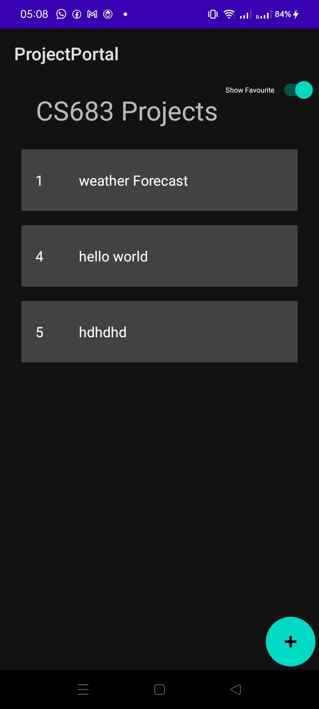

# Lab5

[GithubRepo](https://github.com/CS683/projectportallabs-Shatrugna-Strife) The repo contains the lab5 code and doc too.

- Implemented Room Dao whose methods are wraped around couroutine scopes and the methods are made suspend.

```
@Dao
interface ProjectDao {
    @Insert(onConflict = OnConflictStrategy.REPLACE)
    suspend fun addProject(project: Project)

    @Delete
    fun delProject(project: Project)

    @Update
    suspend fun editProject(project: Project)

    @Query("SELECT count(*) From projects")
    fun count(): Int

    @Query("SELECT * FROM projects")
    suspend fun getAllProjects(): List<Project>

    @Query("SELECT * FROM projects where favourite=1")
    suspend fun getAllFavouriteProjects(): List<Project>

    @Query("SELECT * FROM projects where id = :projId")
    suspend fun searchProjectById(projId: Long): Project

    @Query("SELECT * FROM projects WHERE title like :projTitle ")
    fun searchProjectsByTitle(projTitle:String): List<Project>

    @Update
    suspend fun updateProject(project:Project)
}
```

- The project fragment list fragment implements viewLifecycleOwner.lifecycleScope.async job which awaits in the launch scope to update the adapter project data when the show favourite button is pressed.\


```
binding.projlist.apply{
            layoutManager = when {
                columnCount <= 1 -> LinearLayoutManager(context)
                else -> GridLayoutManager(context, columnCount)
            }
            viewLifecycleOwner.lifecycleScope.launch{
                    adapter = if(binding.favSwitch.isChecked) MyProjListRecyclerViewAdapter(projectDao.getAllFavouriteProjects() as MutableList<Project>) else MyProjListRecyclerViewAdapter(
                        projectDao.getAllProjects() as MutableList<Project>
                    )
            }
//            adapter = if(binding.favSwitch.isChecked) MyProjListRecyclerViewAdapter(projectDao.getAllFavouriteProjects() as MutableList<Project>) else MyProjListRecyclerViewAdapter(
//                projectDao.getAllProjects() as MutableList<Project>
//            )
        }
        binding.addProject.setOnClickListener {
            view.findNavController().navigate(R.id.action_projListRecycleViewFragment_to_createFragment)
        }
        binding.favSwitch.setOnClickListener {
            if(binding.favSwitch.isChecked){
                val bgJob = viewLifecycleOwner.lifecycleScope.async {
                    withContext(Dispatchers.IO) {
                            projectDao.getAllFavouriteProjects()
                    }
                }
                viewLifecycleOwner.lifecycleScope.launch {
                    (binding.projlist.adapter as MyProjListRecyclerViewAdapter).apply {
                        replaceItems(bgJob.await())
                    }
                }

            }else{
                val bgJob = viewLifecycleOwner.lifecycleScope.async {
                    withContext(Dispatchers.IO) {
                        projectDao.getAllProjects()
                    }
                }
                viewLifecycleOwner.lifecycleScope.launch {
                    (binding.projlist.adapter as MyProjListRecyclerViewAdapter).apply {
                        replaceItems(bgJob.await())
                    }
                }
            }

            editor.putInt("fav",  if (binding.favSwitch.isChecked) 1 else 0)
            editor.apply()
            editor.commit()
        }
```

- In rest of the fragments the db calls are wrapped around launch scope of viewLifecycleOwner.lifecycleScope.
```
viewLifecycleOwner.lifecycleScope.launch {
    withContext(Dispatchers.IO) {
        projectDao.addProject(project)
    }
}
```

.png)


Shatrugna Rao Korukanti\
U43517028